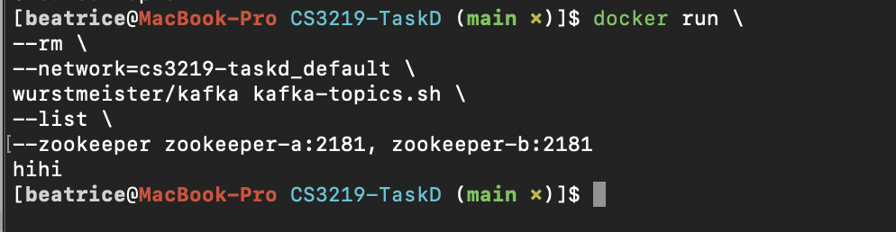
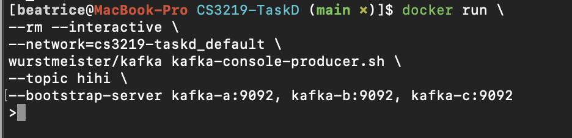
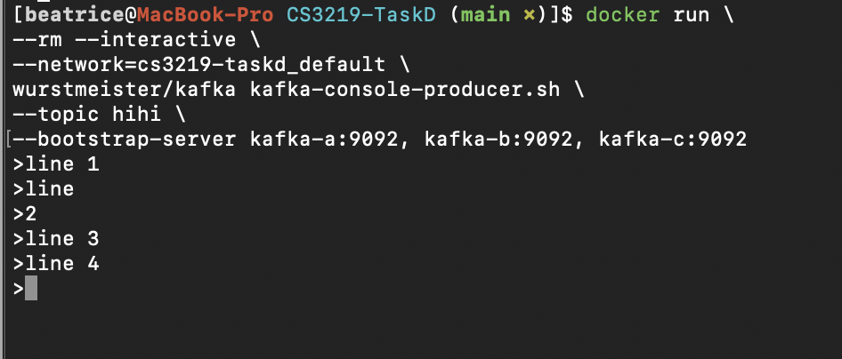
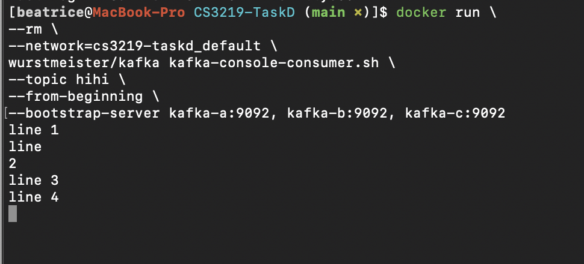
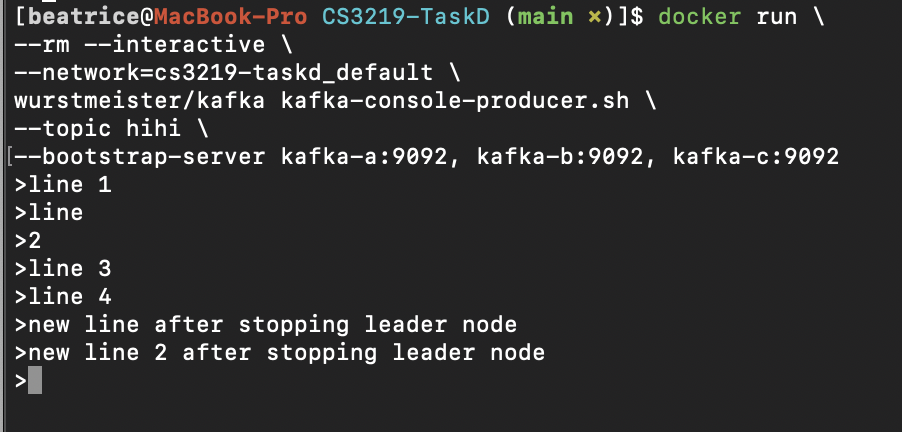

<h1> CS3219 Task D: 3 node Apache Kafka cluster</h1>

<h1>Instructions</h1>
<h3>Setting up Kafka cluster</h3>

1. git clone https://github.com/beatricetay/CS3219-TaskD.git

2. run `docker-compose up -d`

Expected output:

<h3>Running the Kafka cluster: Pub-sub</h3>

Note: You can replace the text in [ ] with your own names

1. Create a topic with [topicName] by runnning the following command:

        docker run \
        --rm \
        --network=cs3219-taskd_default \
        wurstmeister/kafka kafka-topics.sh \
        --create \
        --topic topicName \
        --partitions 1 \
        --replication-factor 3 \
        --zookeeper zookeeper-main:2181

The expected output is: `Created topic [topicName].`

Example:

2. Check whether the creation of [topicName] was successful by running the following command:

        docker run \
        --rm \
        --network=cs3219-taskd_default \
        wurstmeister/kafka kafka-topics.sh \
        --list \
        --zookeeper zookeeper-main:2181

The expected output is `[topicName]`

Example:

3. Create publisher for [topicName] by running the following command:

docker run \
--rm --interactive \
--network=cs3219-taskd_default \
wurstmeister/kafka kafka-console-producer.sh \
--topic topicName \
--bootstrap-server kafka-a:9092, kafka-b:9092, kafka-c:9092

Expected output:

4. Enter several lines of text for testing purposes

Example:

5. Open a new terminal and create consumer for [topicName] by running the following command:

        docker run \
        --rm \
        --network=cs3219-taskd_default \
        wurstmeister/kafka kafka-console-consumer.sh \
        --topic topicName \
        --from-beginning \
        --bootstrap-server kafka-a:9092, kafka-b:9092, kafka-c:9092

It is expected to see the lines you have typed in step 4 printed in the new terminal.

Example:

<h3>Running the Kafka cluster: Testing the mangement of master node failure in the Kafka cluster</h3>

6. After running steps 1 to 5 from above, find out who is the current master node for [topicName] by opening a new terminal and running the following command:

        docker run \
        --rm \
        --network=cs3219-taskd_default \
        wurstmeister/kafka kafka-topics.sh \
        --describe \
        --topic topicName \
        --bootstrap-server kafka-a:9092, kafka-b:9092, kafka-c:9092

Example:

7. Manually create a master node failure by stopping the docker container that is running the master node. The mapping of kafka-id to docker-container-id is,
1:kafka-a, 2:kafka-b, 3:kafka-c

e.g. In the screenshot above, the Leader is 2, which means the kafka-id is 2 and the docker-container-id is kafka-b.

8. Input `docker stop [docker-container-id]`.

e.g. For the kafka id of `2` above, input `docker stop kafka-b`.

8. Enter a few more lines in the terminal that is running the publisher in step 3. It is expected to see the new lines be printed out at the terminal that is running the consumer.

Example for publisher:

Example for consumer:

